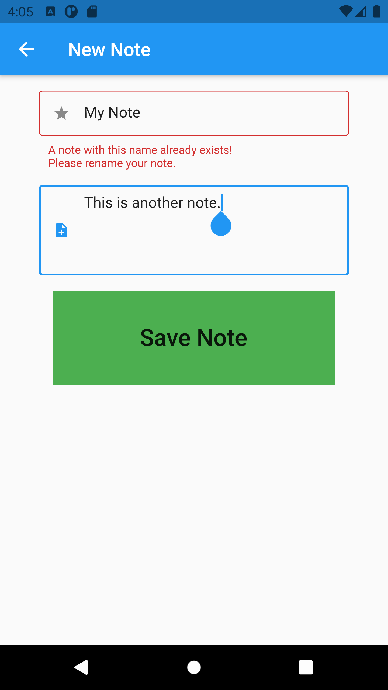

# tcs_notes

A small notes app built to learn Flutter.

**Features**:

* Add, view, edit, & delete notes.
* Basic form validation.
* Uses [Hive](https://docs.hivedb.dev/) for persistence.
* Implements [flutter_slidable](https://pub.dev/packages/flutter_slidable) for list item actions.
* Cross-platform: works on iOS/Android/Web.

**Images**:

     

## Getting Started
* [Flutter Docs](https://flutter.dev/docs)

Clone repo & use the command `flutter run` to start the project.