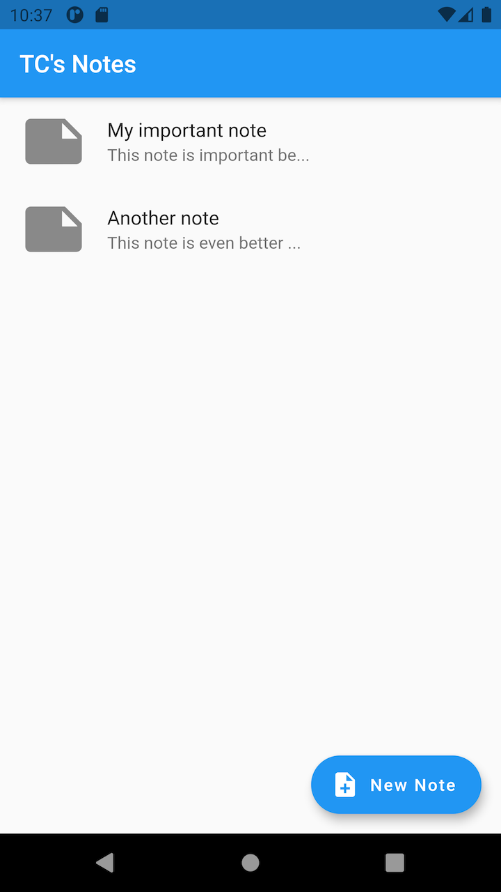

# TC's Notes

A small notes app built to learn Flutter.

 

**Features**:

* Add, view, edit, & delete notes.
* Allows taking a picture & attaching to note on mobile.
* Ability to share notes on Android/iOS (copy to clipboard on others).
* Basic form validation.
* Uses [Hive](https://docs.hivedb.dev/) for persistence.
* Implements [flutter_slidable](https://pub.dev/packages/flutter_slidable) for list item actions.
* Cross-platform: works on iOS/Android/Web.

 

**Images**:

     

 

**Getting Started**:
* [Flutter Docs](https://flutter.dev/docs)

Clone repo & use the command `flutter run` to start the project.

 
 

---
### Connect
---

 **Connect with me** on the sites below && **help me out by following me & sharing my work!**

- **Visit my website** <a href="https://elocnat.com" target="_blank">(`elocnat.com`)</a> to browse my full portfolio!
- **Follow me** and **play my games**: <a href="https://elocnat.itch.io" target="_blank">`elocnat.itch.io`</a>
- **Follow me** on Twitter: <a href="https://twitter.com/elocnat" target="_blank">`@elocnat`</a>
- **Follow me** on GitHub: <a href="https://github.com/elocnatsirt" target="_blank">`@elocnatsirt`</a>
  - **Star** <a href="https://github.com/elocnatsirt/tcs-notes" target="_blank">this project</a>!

 

---
### License
---

- **[WTFPL license](http://www.wtfpl.net/txt/copying/)**

As the license says you are free to do whatever you want with the code. Credit is always appreciated. Any included or referenced third party libraries, code, or other assets fall under the license of their respective creators.
